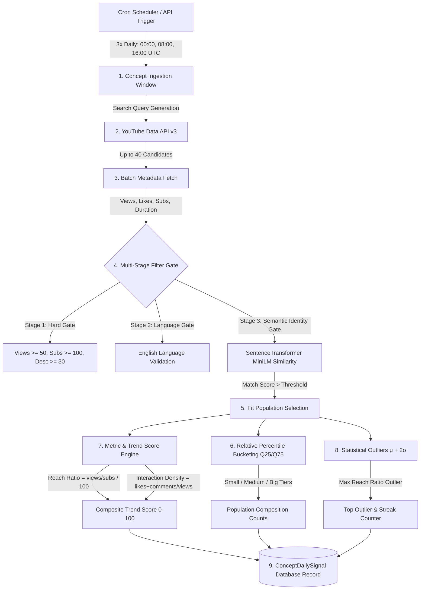

# CreatorIQ — Real-Time Trend Intelligence Pipeline

[](https.python.org)
[](https://fastapi.tiangolo.com)
[](https://react.dev)
[](https://vitejs.dev)

> 💡 **Project Context**: This repository is a specialized real-time ingestion pipeline component within the larger **CreatorIQ** AI SaaS platform. It handles real-time YouTube search candidate discovery, multi-stage semantic filtering, relative channel percentiles, composite **Trend Scoring**, and outlier tracking across monitored niche concepts.

---

## 🎯 Goal-Oriented Project Overview

The objective of this project is to provide a robust, automated **Real-Time YouTube Trend Intelligence Engine** that operates continuously (scheduled 3 times daily at 00:00, 08:00, 16:00 UTC) to identify rising video concepts, quantify creator performance, and produce normalized daily trend signals.

Rather than relying on static creator lists, this pipeline dynamically evaluates real-time YouTube candidate populations for **10 tracked Fitness concepts** defined in [`concepts.yaml`](file:///d:/Projects/Desktop/agy2-projects/CreatorIQ/backend/config/concepts.yaml):

| # | Concept Name | Description | Include Terms (YouTube Search Query) | Targeted Exclude Terms (Domain Separation) |
| :-: | :--- | :--- | :--- | :--- |
| **1** | **Diet** | Nutrition, meal plans, calorie surplus/deficit, and dieting strategies | `"fitness diet"`, `"gym nutrition"`, `"meal prep fitness"`, `"calorie deficit workout"` | `"-supplement review"`, `"-whey protein review"`, `"-pre workout review"` |
| **2** | **Muscle training** | Hypertrophy, resistance training, weight lifting, and muscle building workouts | `"muscle training"`, `"hypertrophy workout"`, `"weight lifting routine"`, `"muscle growth exercises"` | `"-calisthenics bodyweight"`, `"-posing routine stage"`, `"-gym humor meme"` |
| **3** | **Calisthenics** | Bodyweight training, gymnastics strength, muscle-ups, and pull-ups | `"calisthenics"`, `"bodyweight workout"`, `"handstand pushups"`, `"muscle up tutorial"` | `"-heavy barbell bench"`, `"-deadlift max attempt"`, `"-dumbbell curl hypertrophy"` |
| **4** | **Gym Entertainment** | Gym humor, fitness challenges, PR reactions, and fitness creator entertainment | `"gym entertainment"`, `"gym humor"`, `"fitness challenge"`, `"gym meme workout"` | `"-form tutorial guide"`, `"-bench press technique"`, `"-exercise form analysis"` |
| **5** | **Gym time management** | Workout efficiency, busy gym routines, rest interval optimization, and quick workouts | `"gym time management"`, `"efficient workout routine"`, `"quick gym session"`, `"30 minute workout"` | `"-2 hour workout vlog"`, `"-full day of eating"`, `"-gym equipment review"` |
| **6** | **Protein intake strategies** | Whey protein, daily protein targets, protein timing, and muscle recovery nutrition | `"protein intake strategies"`, `"daily protein requirement"`, `"whey protein timing"`, `"high protein meals"` | `"-pre workout supplement review"`, `"-fat loss cardio routine"`, `"-gym equipment review"` |
| **7** | **Bodybuilding** | Competitive bodybuilding, posing routines, muscle symmetry, and prep guides | `"bodybuilding"`, `"classic physique workout"`, `"bodybuilding motivation"`, `"stage prep fitness"` | `"-powerlifting meet max"`, `"-strongman log press"`, `"-gym humor meme"` |
| **8** | **Gym reviews** | Gym equipment reviews, commercial gym tours, supplement reviews, and lifting gear | `"gym review"`, `"gym equipment review"`, `"supplement review fitness"`, `"lifting shoes review"` | `"-bench press form guide"`, `"-squat technique tutorial"`, `"-full workout vlog"` |
| **9** | **How to do exercises** | Exercise form tutorials, bench press technique, squat form tips, and injury prevention | `"how to do exercises"`, `"bench press form tutorial"`, `"squat exercise technique"`, `"deadlift form guide"` | `"-gym meme funny"`, `"-lifting shoes review"`, `"-gym equipment tour"` |
| **10** | **How to improve yourself** | Fitness mindset, discipline, physical transformation guides, and workout consistency | `"how to improve yourself fitness"`, `"fitness transformation mindset"`, `"workout discipline guide"`, `"self improvement gym"` | `"-financial independence passive income"`, `"-stock market investing"`, `"-coding programming tutorial"` |

### 🎯 Targeted Domain Separation Rationale
Exclusion terms are explicitly engineered to **prevent topic overlap between adjacent fitness niches**:
- **Diet vs. Protein Intake & Reviews**: `Diet` excludes `"supplement review"` and `"whey protein review"` so product reviews land in `Gym reviews` and supplement specifics land in `Protein intake strategies`.
- **Bodybuilding vs. Powerlifting**: `Bodybuilding` excludes `"powerlifting meet max"` and `"strongman"` to separate aesthetic stage prep from 1RM max strength lifting.
- **Form Guides vs. Entertainment**: `How to do exercises` excludes `"gym meme funny"` to keep technical form tutorials separate from comedic entertainment content.

---

## 🗺️ High-Level System Architecture & Ingestion Flow



---

## 📂 Repository Directory Documentation

The codebase is organized into clean, decoupled directories with detailed internal documentation:

- 📖 [**Backend Documentation (`backend/README.md`)**](file:///d:/Projects/Desktop/agy2-projects/CreatorIQ/backend/README.md)
  - Full details on FastAPI REST endpoints (`/api/diagnostics`, `/api/concepts`, `/api/signals`, `/api/latest-entries`, `/api/provenance`).
  - Mathematical metric formulas (Reach Ratio, Interaction Density, Composite Trend Score, Outlier $\mu+2\sigma$).
  - Multi-stage pipeline logic, SQLAlchemy ORM models (`Concept`, `ConceptDailySignal`), and CLI command reference.

- 📖 [**Frontend Documentation (`frontend/README.md`)**](file:///d:/Projects/Desktop/agy2-projects/CreatorIQ/frontend/README.md)
  - Single-page Vite + React UI dashboard setup.
  - Real-Time 3x/Day status panel, **Top Populated Entries Leaderboard** with Trend Score progress gauges, and raw database inspection tools.

---

## 🚀 Quickstart & Setup Guide

### 1. Backend Setup & Data Seeding

```bash
cd backend

# 1. Create and activate Python virtual environment
python -m venv myvenv
myvenv\Scripts\activate      # Windows
source myvenv/bin/activate   # macOS/Linux

# 2. Install backend dependencies
pip install -r requirements.txt

# 3. Create .env from template and add Youtube_API_KEY
cp ../.env-samples ../.env

# 4. Recreate database tables with new schema
myvenv\Scripts\python -m app.main recreate-db --yes

# 5. Seed the 10 Fitness concepts into the database
myvenv\Scripts\python -m app.main seed-db

# 6. Start the FastAPI backend server
myvenv\Scripts\uvicorn app.main:api_app --host 127.0.0.1 --port 8000
```

*Backend API Docs*: [http://127.0.0.1:8000/docs](http://127.0.0.1:8000/docs)

### 2. Frontend Setup

In a new terminal window:

```bash
cd frontend

# Install frontend dependencies
npm install

# Start Vite React development server
npm run dev
```

*Frontend Dashboard*: [http://localhost:5173](http://localhost:5173)

---

## 🧪 Testing & Verification

Run the automated test suite to verify pipeline calculations, semantic similarity filtering, and idempotency:

```bash
cd backend
myvenv\Scripts\pytest tests -v
```

---

## 📄 License & Ecosystem Context

Part of the **CreatorIQ** AI SaaS ecosystem. Proprietary — All rights reserved.
