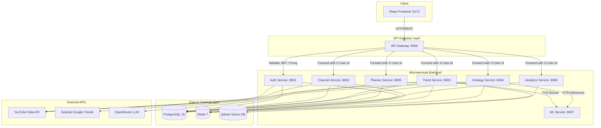

# Current Architecture Overview (CreatorIQ)

This document provides a detailed reference of the current CreatorIQ system's architecture, service breakdown, database models, and communication patterns. Since the repository is being cleaned of production settings and will later be recreated, this document serves as an authoritative guide to how the system currently operates.

---

## 🏗️ System Architecture

CreatorIQ is built using a **modular microservices backend** with a **Vite/React frontend**. The backend consists of 8 separate services communicating via synchronous HTTP calls and utilizing shared storage/caching components.

---

## 📡 Service Breakdown & Responsibilities

### 1. API Gateway (`:8000`)
* **Role**: Public entry point. All client requests are directed here.
* **Key Tasks**:
  * **JWT Validation**: Inspects the `Authorization: Bearer <token>` header, decodes and verifies the signature (using public keys from `backend/secrets/jwt_public.pem`).
  * **User Claims Extraction**: Converts the JWT claims into trusted headers (`X-User-Id`, `X-User-Email`, `X-Plan-Tier`) and drops the original Authorization header before proxying upstream.
  * **Request Routing**: Dynamically resolves request paths (e.g. `/v1/trends/*` → `http://trend:8003/trends/*`) and forwards them using an async HTTP client (`httpx`).
  * **Rate Limiting**: Throttles requests based on client IPs using Redis counters.

### 2. Auth Service (`:8001`)
* **Role**: Manages identity, access tokens, and third-party credential links.
* **Key Tasks**:
  * User registration and login (email/password).
  * **JWT Lifecycle**: Issues access tokens (RS256 signature, 15-minute expiry) and refresh tokens (90-day expiry).
  * **Google/YouTube OAuth**: Generates OAuth authorization URLs, accepts callbacks, exchanges codes for YouTube tokens, and encrypts OAuth access/refresh tokens at rest (using AES-256 Fernet encryption).

### 3. Channel Service (`:8002`)
* **Role**: Manages YouTube channels and creator profiles.
* **Key Tasks**:
  * Syncs creator profiles (YouTube channel name, subscriber count, avatar) during onboarding.
  * Persists channel configurations (niche classification, target audience geo, content format, tone of voice).

### 4. Trend Service (`:8003`)
* **Role**: Core intelligence engine, fetches and scores trending concepts.
* **Key Tasks**:
  * **Ingestion Pipelines**: Hits the YouTube Data API to fetch live video velocity signals, and SerpApi to pull Google Trends.
  * **Quality Filters**: Discards irrelevant news spikes or system noise, prioritizing high-value creator topics.
  * **Trend Velocity Score (TVS)**: Calculates growth rates, volatility, and geographical interest scores.
  * **AI Enrichment**: Dispatches raw signals to the Strategy Service or directly to OpenRouter to append catchy angles, titles, and video suggestions.
  * **Feed Snapshotting**: Stores the user's daily "Top 5" personalized trends and allows viewing past snapshots.

### 5. Strategy Service (`:8004`)
* **Role**: Produces AI strategy briefs and script templates.
* **Key Tasks**:
  * Connects to OpenRouter (default model: `openai/gpt-4o-mini`).
  * Compiles complete content plans: titles, retention hooks, body scripts, call-to-actions, and SEO tags tailored to the creator's profile settings.

### 6. Planner Service (`:8005`)
* **Role**: Content scheduling and calendar management.
* **Key Tasks**:
  * Traditional CRUD backend for scheduling video concepts, strategy briefs, and drafts.

### 7. Analytics Service (`:8006`)
* **Role**: Performance insights dashboard.
* **Key Tasks**:
  * Aggregates channel metrics (retention, traffic sources, audience demographic snapshots).

### 8. ML Service (`:8007`)
* **Role**: Model inference for predictive scoring.
* **Key Tasks**:
  * Calculates trend momentum forecasts.
  * Scores click-through-rate (CTR) possibilities based on historical performance vectors.

---

## 🗄️ Database & Caching Topology

### 1. PostgreSQL (Modular Monolith Setup)
Each microservice is assigned its own Postgres database schema, ensuring strict separation of concerns. In local development and Docker Compose, this runs in a single Postgres container, but tables are isolated:
* **Auth**: `users`, `oauth_tokens`, `sessions`
* **Channel**: `channels`, `creator_profiles`
* **Trend**: `trend_concepts`, `concept_signals`, `trend_feed_snapshots`, `saved_trends`
* **Strategy**: `strategy_briefs`, `generated_content`
* **Planner**: `planner_slots`
* **Analytics**: `channel_metrics`, `audience_demographics`

### 2. Redis 7
Used as a high-speed, volatile cache and coordination hub:
* Caching trend feeds to avoid repeated database calls.
* Saving rate limit counters.
* Storing temporary state parameters for OAuth flows.

### 3. Qdrant Vector DB (`:6333`)
Located in `backend/services/trend/app/services/vector_service.py`, Qdrant stores semantic representations of trend concepts.
* **Vector Specifications**: 128-dimensional unit hypersphere vectors using Cosine similarity.
* **Vector Generation**: A custom lightweight keyword-hashing and niche-anchoring algorithm maps text keywords (Gaming, Tech, Finance, etc.) to distinct dimensions.
* **Usage**: Prevents duplicate concept ingestion and finds semantically related trends for creator niche feeds.

---

## 📡 Cross-Service Integration & Security

1. **Authentication**: All public endpoints are routed through the API Gateway, which requires a Bearer JWT. Inside the private microservice network, downstream services trust requests by reading header attributes:
   * `X-User-Id`: The authenticated user's ID.
   * `X-User-Email`: The authenticated user's email.
   * `X-Plan-Tier`: User tier (e.g. Free, Pro) for feature gating.
2. **Service-to-Service Secret**: Direct calls between services (bypassing the gateway) are secured by verifying a shared token passed via the HTTP header `X-Internal-Service-Token`.
3. **Database schema initialization**: Done via `db_push.py` scripts inside each microservice. During bootstrap, these run SQLAlchemy's metadata creation (`Base.metadata.create_all`) to construct tables instantly, avoiding complex Alembic migration setups in early development.
